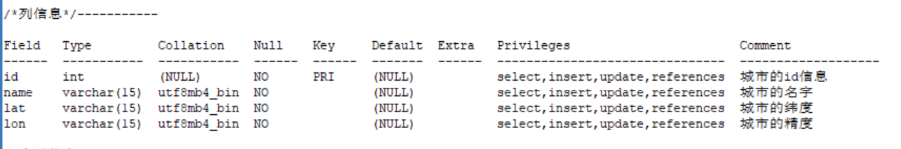
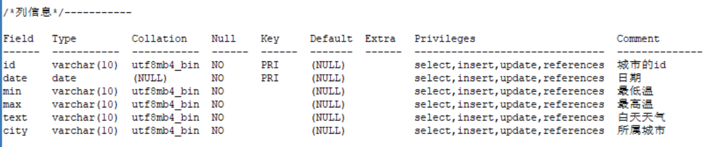

# West2Online_Java
## 西二考核第三轮
### · 使用Maven进行项目构建
### · 数据库使用Mysql，数据库可视化工具使用Sqlyog
### · 数据库连接使用Mybatis框架（仅用到增删改查）
### · 使用和风天气城市查询以及三日天气查询api

------
## 项目细节
### · 两个模块，其中主模块为WeatherQuery，另一个模块是学习Mybatis的过程记录。
### · 主模块中com.gallon为预设的域名（以便符合命名规范）该包下的目录结构以目的：
| package | aim |
|:--------|:----|
|dao、myBatisUtils | 配合Mybatis框架使用|
|pojo | 存放实体类|
|pojomini |存放实体类的简易版本（包含本次需求中指定的信息）|
|util|存放三个工具类|
|view|存放控制台UI的实现|

### ·建表文件文件名为create_table，位置在根目录下
### 【由于建表过程经历了几次重新设计，文件内语句较杂乱，下面给出数据库设计方案截图】
#### 表1、city_info 

#### 表2、weather
